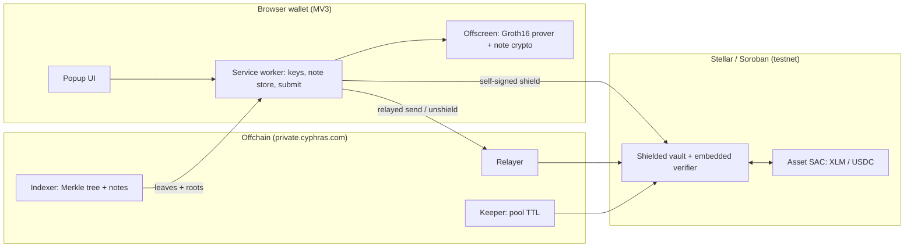
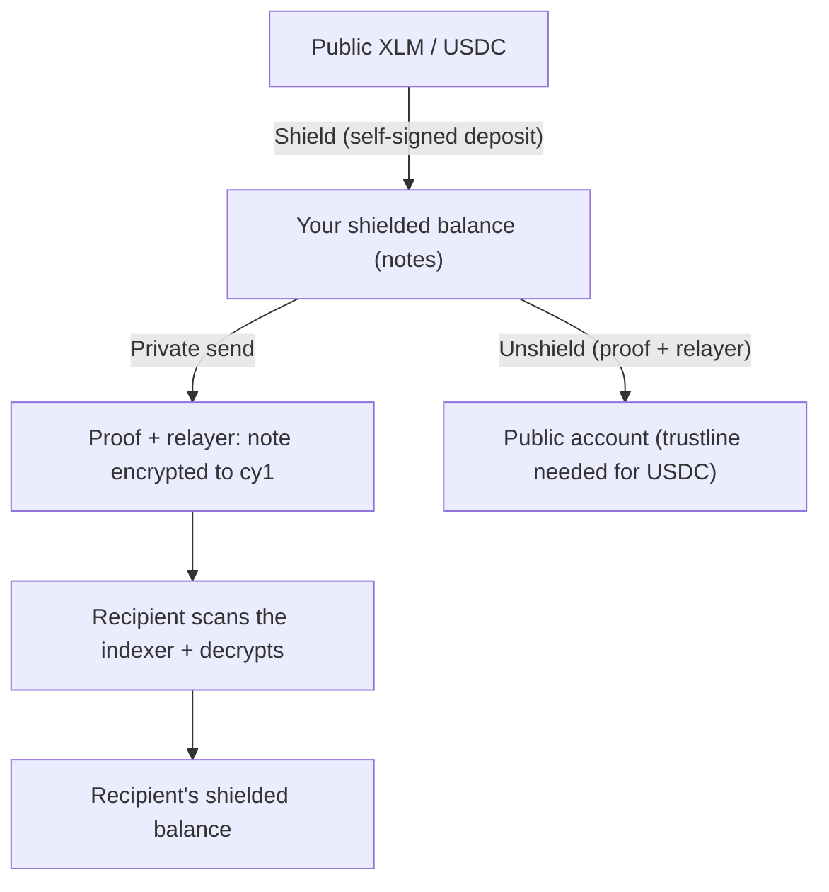
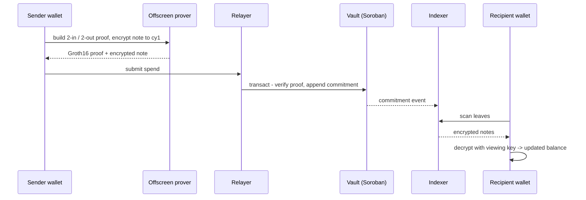

  
  <h1>Cyphras</h1>
  
A privacy wallet for Stellar - a shielded private mode backed by zero-knowledge proofs.

  
  
  
  

---

Cyphras is a non-custodial Chrome (MV3) wallet with a shielded "private mode" layered on
top of a full Stellar wallet: a private balance you hold, and private transfers to other
users through a stealth address, backed by zero-knowledge proofs.

## What it does

### Wallet

- Non-custodial accounts with HD key derivation (BIP44); import via recovery phrase or secret key
- Sign transactions, messages, and authorization entries; connect to dApps through a single approval flow
- Balances with fiat values, swaps, custom assets, multi-network support, session auto-lock, popup or side panel

### Private mode

A shielded pool the wallet drives end to end:

- Shield: deposit public XLM or USDC into your private balance
- Private send: send to another user's private address (`cy1...`); the recipient discovers and spends the note, with sender, amount, and link hidden
- Unshield: move your private balance back to a public account
- Multi-pool: a separate shielded pool per asset (XLM, USDC), with balances kept isolated
- Fiat total plus a per-token view, and one private address that receives every asset
- Auto-split: move a balance spread across many notes in a single action, submitted through the relayer so your public account is never touched
- Guided add-trustline flow when you unshield an asset your account does not yet hold

## Architecture

## How private mode works

- A 2-in / 2-out JoinSplit shielded UTXO pool on Soroban, in the style of Zcash and Tornado Nova
- Stealth addresses (`cy1...`) derived from Baby Jubjub viewing and spend keys; each note is ECDH-encrypted so only the recipient can find and spend it
- Groth16 (BN254) proofs generated inside the wallet; the vault verifies them on-chain before moving value
- A relayer submits shielded spends, so the user's public account is never the transaction source
- An indexer serves the commitment tree, and a keeper keeps pool state alive on-chain

Private mode is testnet only. Its proving key comes from a single-party setup, which is
fine for testnet but not for real value; enabling it on mainnet requires a multi-party
trusted-setup ceremony first.

## End-to-end flow

A private send, step by step:

## Contracts

Soroban workspace in `contracts/`:

- `vault` - the shielded-pool vault: deposits, the Merkle commitment tree, nullifiers, and in-process proof verification. The only deployed contract, one instance per asset.
- `verifier` - Groth16 / BN254 verifier with a compile-time embedded verification key; linked into the vault as a library, not deployed on its own.
- `poseidon2` - Poseidon2 hash over BN254, used for the commitment tree and note commitments.
- `types` - shared contract types (proof, ext data, errors).

Deployed on testnet - both vaults carry the same vault wasm and verification key:

| Pool | Vault contract | Asset |
| --- | --- | --- |
| XLM (domain 67890) | `CDPUJYCTPGPEGS6MBXYLEWTYSGCPVKUHCURLF2ORT3RAVL5TF5JKIAI5` | native, SAC `CDLZFC3SYJYDZT7K67VZ75HPJVIEUVNIXF47ZG2FB2RMQQVU2HHGCYSC` |
| USDC (domain 67891) | `CA4LFR3TYDARWQ3YHUD72X6ZKVXL3BJWA7ZLDVSMOHAVEOQXU7ESOBBQ` | `USDC:GBBD47IF6LWK7P7MDEVSCWR7DPUWV3NY3DTQEVFL4NAT4AQH3ZLLFLA5`, SAC `CBIELTK6YBZJU5UP2WWQEUCYKLPU6AUNZ2BQ4WWFEIE3USCIHMXQDAMA` |

- Vault admin: `GAEEH5TB44ZLBZ7PLWHGNRH2VFYGIE4YKF2Z34JXBNWSB7NVDD6HL2JC`
- Vault wasm hash: `ec8ddd75df79ee58722a0ce350828e45a9e8c2593b4a3cf9cabcba8a95d5355d` - one wasm for both vaults; it embeds the verifier, poseidon2, and types (the vault exposes `verify` directly)
- Verification key sha256: `0e4e9d81c4a30c4969fa9e66c098934f53a23490a914cf1b5be6ef638c056c3e`
- Relayer account: `GASOF6NKJJWYE4AB2SFXK6RD26VBYGWNK2KL7TLZT2S3YRS3NRQWH4UQ`
- Offchain (indexer + relayer + keeper): `https://private.cyphras.com`

## Structure

- `extension/` - the wallet (Chrome MV3 extension)
- `contracts/` - Soroban contracts for the shielded pool (vault + embedded verifier)
- `circuits/` - circom circuits and proving artifacts
- `offchain/` - relayer, indexer, and keeper

## Build

See `extension/README.md` for building and loading the wallet. Each component directory
has its own README.

## Links

- Live wallet (mainnet): https://cyphras.com
- Private mode in this repo is testnet only.

## License

Apache-2.0. See `LICENSE` and `NOTICE`.
