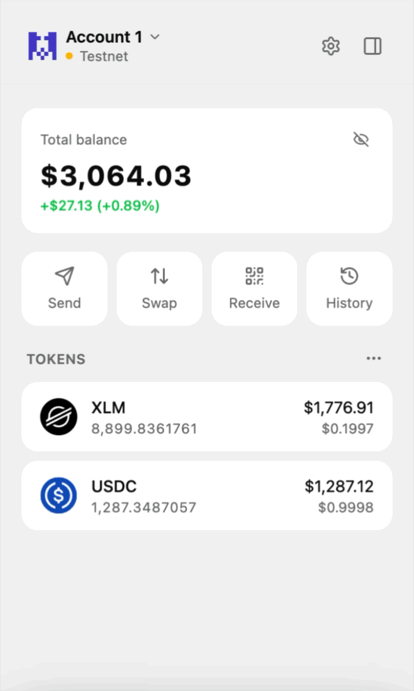
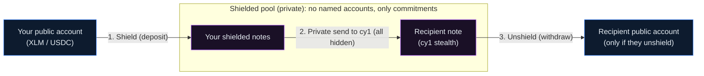
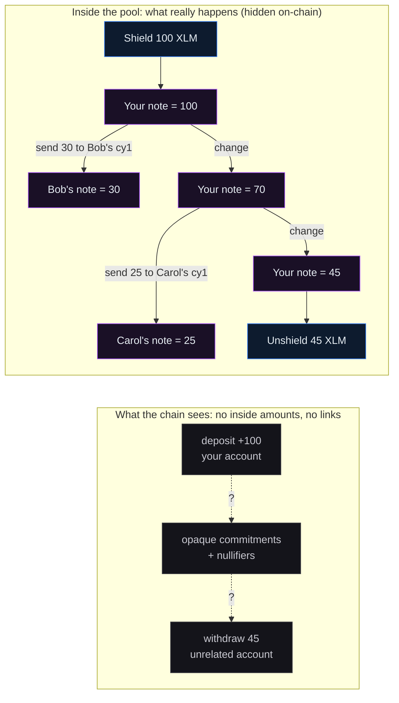
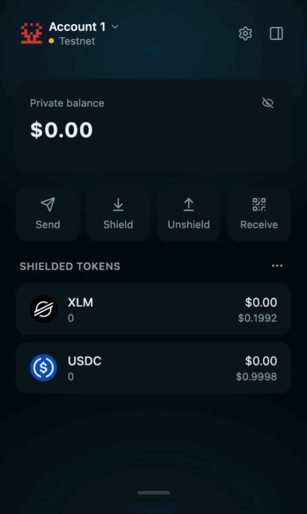
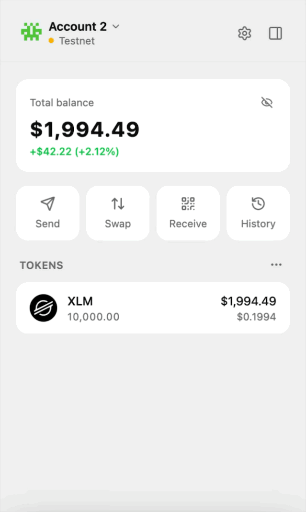
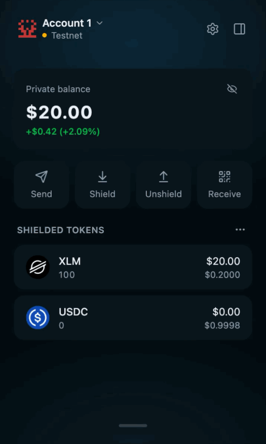
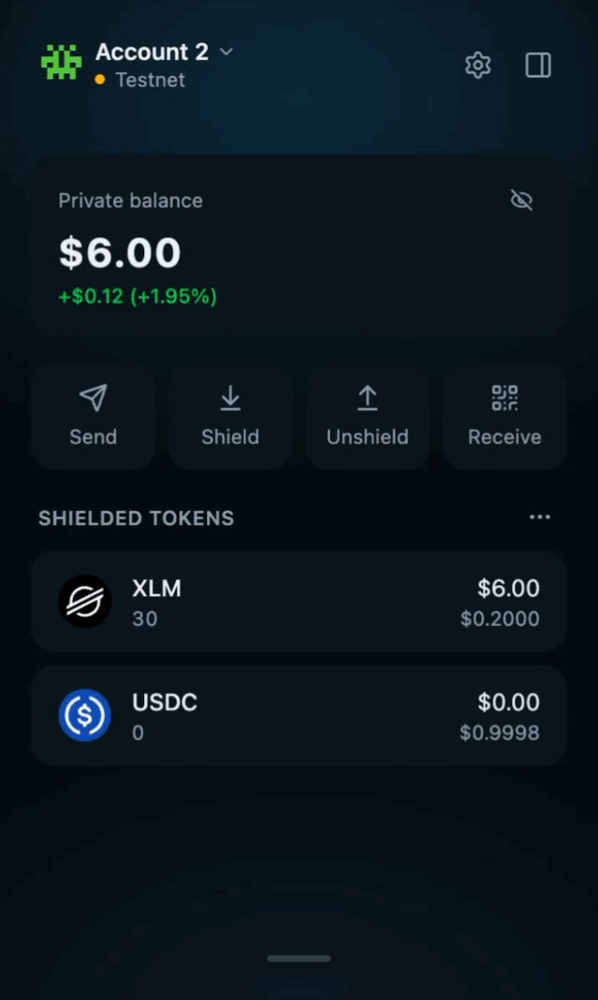
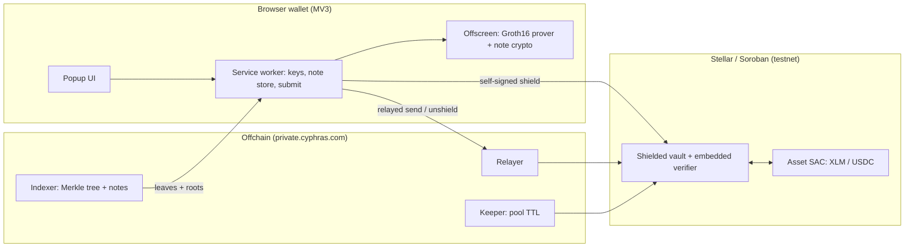
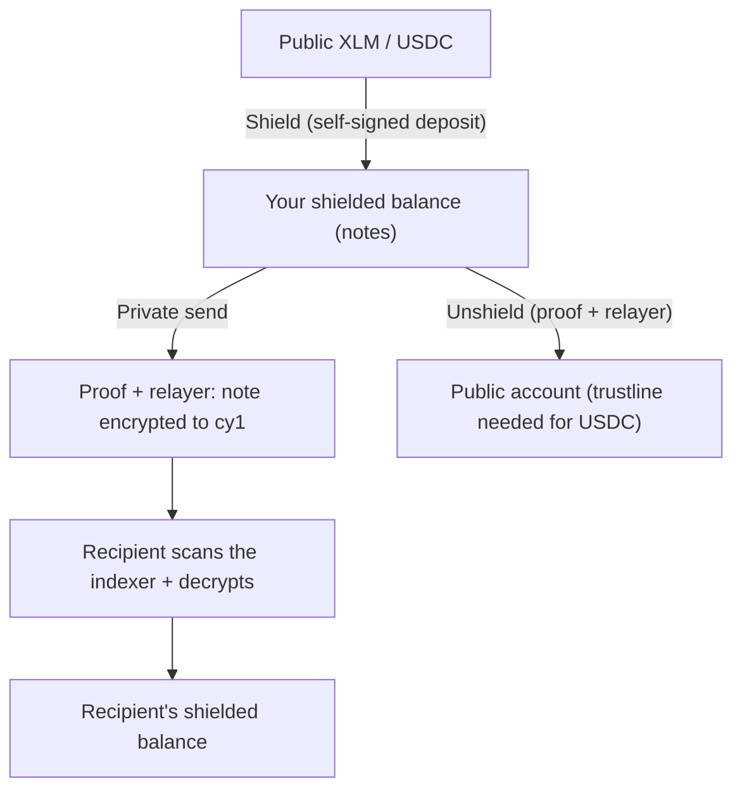
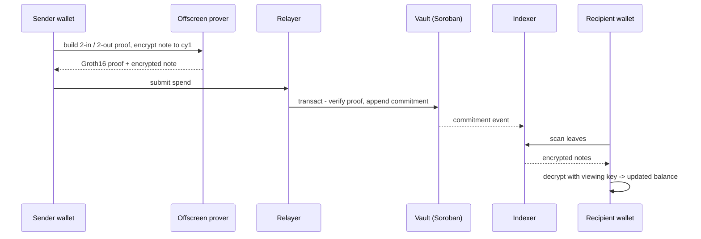

  
  <h1>Cyphras</h1>
  
A privacy wallet for Stellar - a shielded private mode backed by zero-knowledge proofs.

  
  
  
  
  

---

Cyphras is a non-custodial Chrome (MV3) wallet with a shielded "private mode" layered on
top of a full Stellar wallet: a private balance you hold, and private transfers to other
users through a stealth address, backed by zero-knowledge proofs.

  

> [!IMPORTANT]
> **Testnet limits per shield (deposit):** XLM up to **100 XLM** per transaction (pool cap **100,000 XLM**); USDC up to **10,000 USDC** per transaction (pool cap **1,000,000 USDC**).

## Contracts

Soroban workspace in `contracts/`:

- `vault` - the shielded-pool vault: deposits, the Merkle commitment tree, nullifiers, and in-process proof verification. The only deployed contract, one instance per asset.
- `verifier` - Groth16 / BN254 verifier with a compile-time embedded verification key; linked into the vault as a library, not deployed on its own.
- `poseidon2` - Poseidon2 hash over BN254, used for the commitment tree and note commitments.
- `types` - shared contract types (proof, ext data, errors).

Deployed on testnet - both vaults carry the same vault wasm and verification key:

| Pool | Vault contract | Asset |
| --- | --- | --- |
| XLM (domain 67890) | `CDPUJYCTPGPEGS6MBXYLEWTYSGCPVKUHCURLF2ORT3RAVL5TF5JKIAI5` | native, SAC `CDLZFC3SYJYDZT7K67VZ75HPJVIEUVNIXF47ZG2FB2RMQQVU2HHGCYSC` |
| USDC (domain 67891) | `CA4LFR3TYDARWQ3YHUD72X6ZKVXL3BJWA7ZLDVSMOHAVEOQXU7ESOBBQ` | `USDC:GBBD47IF6LWK7P7MDEVSCWR7DPUWV3NY3DTQEVFL4NAT4AQH3ZLLFLA5`, SAC `CBIELTK6YBZJU5UP2WWQEUCYKLPU6AUNZ2BQ4WWFEIE3USCIHMXQDAMA` |

- Vault admin: `GAEEH5TB44ZLBZ7PLWHGNRH2VFYGIE4YKF2Z34JXBNWSB7NVDD6HL2JC`
- Vault wasm hash: `ec8ddd75df79ee58722a0ce350828e45a9e8c2593b4a3cf9cabcba8a95d5355d` - one wasm for both vaults; it embeds the verifier, poseidon2, and types (the vault exposes `verify` directly)
- Verification key sha256: `0e4e9d81c4a30c4969fa9e66c098934f53a23490a914cf1b5be6ef638c056c3e`
- Relayer account: `GASOF6NKJJWYE4AB2SFXK6RD26VBYGWNK2KL7TLZT2S3YRS3NRQWH4UQ`
- Offchain (indexer + relayer + keeper): `https://private.cyphras.com`

## Confidential vs anonymous

Stellar's Confidential Tokens hide the amount of a transfer, but the sender and recipient
stay public accounts, so an observer can still see who paid whom. Cyphras private mode goes
further: the sender, the recipient, and the amount are all hidden. Confidential hides how
much; Cyphras hides who.

Here is the same deposit / transfer / withdraw flow, done the Cyphras way:

```mermaid
flowchart LR
  S["Your public account<br/>(XLM / USDC)"]
  subgraph Pool["Shielded pool (private): no named accounts, only commitments"]
    direction LR
    N1["Your shielded notes"] -->|"2. Private send to cy1 (all hidden)"| N2["Recipient note<br/>(cy1 stealth)"]
  end
  R["Recipient public account<br/>(only if they unshield)"]
  S -->|"1. Shield (deposit)"| N1
  N2 -->|"3. Unshield (withdraw)"| R
  classDef public fill:#0d1b2e,stroke:#3b82f6,color:#e6edf3;
  classDef note fill:#1a1026,stroke:#a855f7,color:#e6edf3;
  class S,R public;
  class N1,N2 note;
```

**What is public, and what is hidden**

- **1. Shield (deposit)** - you move public XLM or USDC into the pool from your own account. The deposit and its amount are visible on the base ledger (like the "wrap" step), and it is the only public link to you.
- **2. Private send** - happens entirely inside the pool. There is no sender or recipient address on-chain, only a new commitment. The recipient is a stealth address (`cy1...`) that they find by scanning and decrypting, and a relayer submits the transaction so your own account is never the source. Sender, recipient, and amount are all hidden.
- **3. Unshield (withdraw)** - the pool pays out to a public account through the relayer. Only this exit is visible.

In the Confidential Token flow, User A and User B stay named accounts on both sides, so an
observer sees that A paid B, just not how much. In Cyphras there are no named accounts
inside the pool and the recipient is a stealth address, so who paid whom is hidden too.

**Why it cannot be traced**

Once value is inside the pool it is no longer an account balance - it is a set of
commitments (notes). Every private transaction spends notes and creates new ones, and a
nullifier proves a note has not been spent before without ever revealing which note it
was, so nothing on-chain links what went in to what comes out.

From there you can send any amount to any `cy1` stealth address, as often as you like, and
unshield any amount to any public account, at any time. A withdrawal does not have to match
a deposit in amount, destination, or timing. Because the amounts and the note-to-note links
are hidden, an observer watching the base ledger sees deposits go in and withdrawals come
out but cannot tell which came from which - the trail is broken. That unlinkability,
together with the hidden sender and recipient, is what makes it anonymous, not just private.

Here is an example of activity inside the pool, and what the chain can actually see:

```mermaid
flowchart TB
  subgraph Inside["Inside the pool: what really happens (hidden on-chain)"]
    direction TB
    D["Shield 100 XLM"] --> A100["Your note = 100"]
    A100 -->|"send 30 to Bob's cy1"| BOB["Bob's note = 30"]
    A100 -->|"change"| A70["Your note = 70"]
    A70 -->|"send 25 to Carol's cy1"| CAR["Carol's note = 25"]
    A70 -->|"change"| A45["Your note = 45"]
    A45 --> WOUT["Unshield 45 XLM"]
  end
  subgraph Chain["What the chain sees: no inside amounts, no links"]
    direction LR
    CIN["deposit +100<br/>your account"] -.->|"?"| COMM["opaque commitments<br/>+ nullifiers"] -.->|"?"| COUT["withdraw 45<br/>unrelated account"]
  end
  CAR ~~~ CIN
  WOUT ~~~ CIN
  classDef note fill:#1a1026,stroke:#a855f7,color:#e6edf3;
  classDef pub fill:#0d1b2e,stroke:#3b82f6,color:#e6edf3;
  classDef chain fill:#14141a,stroke:#3f3f46,color:#c9c9d1;
  class A100,BOB,A70,CAR,A45 note;
  class D,WOUT pub;
  class CIN,COMM,COUT chain;
```

An observer sees only the 100 XLM going in and the 45 XLM coming out to an unrelated
account, and cannot prove the two are related. The 30 to Bob and the 25 to Carol stay
inside the pool and never appear on-chain at all.

## Demo

An end-to-end private payment between two wallets - wallet 1 (sender) and wallet 2 (recipient): shield, receive, send, unshield.

<table>
  <tr>
    <td align="center"><b>1. Shield</b> - wallet 1 (sender) deposits XLM into private </td>
    <td align="center"><b>2. Receive</b> - wallet 2 (recipient) copies its private cy1 address </td>
  </tr>
  <tr>
    <td align="center"><b>3. Private send</b> - wallet 1 (sender) sends privately to wallet 2's cy1 </td>
    <td align="center"><b>4. Unshield</b> - wallet 2 (recipient) moves the balance back to public </td>
  </tr>
</table>

## What it does

### Wallet

- Non-custodial accounts with HD key derivation (BIP44); import via recovery phrase or secret key
- Sign transactions, messages, and authorization entries; connect to dApps through a single approval flow
- Balances with fiat values, swaps, custom assets, multi-network support, session auto-lock, popup or side panel

### Private mode

A shielded pool the wallet drives end to end:

- Shield: deposit public XLM or USDC into your private balance
- Private send: send to another user's private address (`cy1...`); the recipient discovers and spends the note, with sender, amount, and link hidden
- Unshield: move your private balance back to a public account
- Multi-pool: a separate shielded pool per asset (XLM, USDC), with balances kept isolated
- Fiat total plus a per-token view, and one private address that receives every asset
- Auto-split: move a balance spread across many notes in a single action, submitted through the relayer so your public account is never touched
- Guided add-trustline flow when you unshield an asset your account does not yet hold
- Testnet safety limits per pool: up to 100 XLM (or 10,000 USDC) per shield, and a pool cap of 100,000 XLM (or 1,000,000 USDC)

## Architecture

```mermaid
flowchart LR
  subgraph Wallet["Browser wallet (MV3)"]
    UI["Popup UI"]
    BG["Service worker: keys, note store, submit"]
    OFF["Offscreen: Groth16 prover + note crypto"]
    UI --> BG --> OFF
  end
  subgraph Offchain["Offchain (private.cyphras.com)"]
    RLY["Relayer"]
    IDX["Indexer: Merkle tree + notes"]
    KPR["Keeper: pool TTL"]
  end
  subgraph Soroban["Stellar / Soroban (testnet)"]
    VLT["Shielded vault + embedded verifier"]
    SAC["Asset SAC: XLM / USDC"]
  end
  BG -->|"self-signed shield"| VLT
  BG -->|"relayed send / unshield"| RLY --> VLT
  VLT <--> SAC
  IDX -->|"leaves + roots"| BG
  KPR --> VLT
```

## How private mode works

- A 2-in / 2-out JoinSplit shielded UTXO pool on Soroban, in the style of Zcash and Tornado Nova
- Stealth addresses (`cy1...`) derived from Baby Jubjub viewing and spend keys; each note is ECDH-encrypted so only the recipient can find and spend it
- Groth16 (BN254) proofs generated inside the wallet; the vault verifies them on-chain before moving value
- A relayer submits shielded spends, so the user's public account is never the transaction source
- An indexer serves the commitment tree, and a keeper keeps pool state alive on-chain

Private mode is testnet only. Its proving key comes from a single-party setup, which is
fine for testnet but not for real value; enabling it on mainnet requires a multi-party
trusted-setup ceremony first.

## End-to-end flow

```mermaid
flowchart TD
  P["Public XLM / USDC"] -->|"Shield (self-signed deposit)"| N["Your shielded balance (notes)"]
  N -->|"Private send"| SEND["Proof + relayer: note encrypted to cy1"]
  SEND --> SCAN["Recipient scans the indexer + decrypts"]
  SCAN --> RB["Recipient's shielded balance"]
  N -->|"Unshield (proof + relayer)"| OUT["Public account (trustline needed for USDC)"]
```

A private send, step by step:

```mermaid
sequenceDiagram
  participant S as Sender wallet
  participant O as Offscreen prover
  participant R as Relayer
  participant V as Vault (Soroban)
  participant I as Indexer
  participant Rc as Recipient wallet
  S->>O: build 2-in / 2-out proof, encrypt note to cy1
  O-->>S: Groth16 proof + encrypted note
  S->>R: submit spend
  R->>V: transact - verify proof, append commitment
  V-->>I: commitment event
  Rc->>I: scan leaves
  I-->>Rc: encrypted notes
  Rc->>Rc: decrypt with viewing key -> updated balance
```

## Structure

- `extension/` - the wallet (Chrome MV3 extension)
- `contracts/` - Soroban contracts for the shielded pool (vault + embedded verifier)
- `circuits/` - circom circuits and proving artifacts
- `offchain/` - relayer, indexer, and keeper

## Build

See `extension/README.md` for building and loading the wallet. Each component directory
has its own README.

## Links

- Live wallet (mainnet): https://cyphras.com
- Private mode in this repo is testnet only.

## License

Apache-2.0. See `LICENSE` and `NOTICE`.
