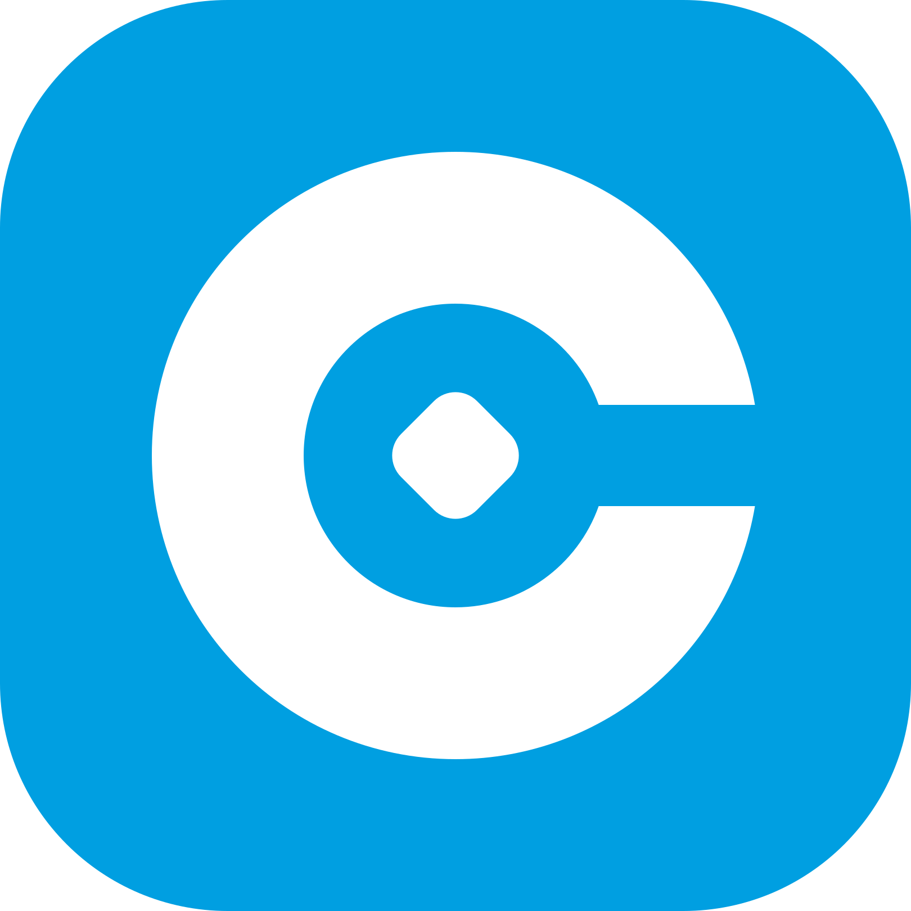

<div align="center">
  
  <h1>Cyphras</h1>
  <p>A non-custodial browser wallet for multiple blockchain networks.</p>

  <a href="LICENSE"></a>
  
  
</div>

---

Manage accounts, sign transactions, and connect to decentralized applications, all from your browser.

## Features

- Private payments on Stellar mainnet and testnet: send XLM and Stellar assets with the sender, amount, and on-chain link hidden, using zero-knowledge proofs
- Create and import wallets using a recovery phrase or secret key
- Multiple accounts with HD key derivation (BIP44)
- Connect to dApps with a single approval flow
- Sign transactions, messages, and authorization entries
- Add custom assets and tokens
- Multiple network support, including custom RPC endpoints
- Automatic session lock with configurable timeout
- Runs as a popup or side panel

## Development

**Requirements:** Node.js 20+

```bash
npm install
bash build.sh
```

Load the `dist/` folder as an unpacked extension in Chrome (`chrome://extensions` > Load unpacked).

## SDK

dApp developers can integrate with Cyphras using the [`@cyphras/sdk`](https://github.com/cyphras/cyphras-sdk) package.

## License

Apache 2.0. See [LICENSE](LICENSE) for details.
